# Pi Deck — macOS desktop app for Pi coding agents

**A local macOS desktop app for Pi coding agents.**

Pi Deck is a Pi coding-agent GUI that gives Pi a dedicated desktop control plane for running, watching, and steering coding-agent sessions without opening Pi's terminal UI. Its primary path is **All Work → workspace Work → session detail**: All Work supervises active and saved work across workspaces, selecting a workspace scopes that same Work surface, and selecting an item opens the existing Pi conversation. **Agent Workflows** remains a separate advanced orchestration surface. Visit [the Pi Deck website](https://liusuzeng.github.io/pi-deck/) for an overview.

> **Status:** Pi Deck is an active, pre-release personal MVP. It currently runs from source and targets macOS.

## At a glance

| Organize the work                                                                                                                            | Automate repeatable work                                                                                               | Triage what matters                                                                                                    | Direct the next step                                                                                                                                                       |
| -------------------------------------------------------------------------------------------------------------------------------------------- | ---------------------------------------------------------------------------------------------------------------------- | ---------------------------------------------------------------------------------------------------------------------- | -------------------------------------------------------------------------------------------------------------------------------------------------------------------------- |
| Named workspaces keep related sessions organized independently of folders. [Explore workspaces](#workspaces-projects-and-pi-native-sessions) | Agent Workflows compose Workers, Deciders, Orchestrators, and Human checkpoints. [Explore workflows](#agent-workflows) | **All Work** supervises active and saved work globally, then scopes to the selected workspace. [Explore Work](#all-work-workspace-work-and-session-detail) | Session detail keeps chat, tools, model controls, files, images, and optional Parallel mode in one control plane. [Explore session detail](#multi-session-control-and-multitasking) |

## What Pi Deck is

Pi Deck is a **local agent harness** for developers who already use Pi and want a clearer way to manage ongoing work:

- Organize related Pi sessions into named workspaces independent of their folders.
- Open a project and continue its previous Pi sessions from the appropriate workspace.
- Start a session directly without first managing a workspace; Pi Deck assigns global creation to its persisted default workspace internally.
- Run multiple independent Pi workers without managing terminal windows.
- Create reusable Agent Workflows with explicit roles, routing, and Human checkpoints.
- Enable parallel mode so a parent automatically plans independent work into private task sessions and reports a synthesized result.
- Switch workspaces and projects while active work remains attached in the background; choosing a workspace opens its scoped Work overview.
- Send prompts, files, and images from a graphical composer.
- Change models and thinking levels from the session workspace.
- Watch streaming replies, thinking, tool execution, usage, and errors.
- Steer, queue a follow-up, answer extension requests, or abort a turn.

Pi Deck is **not** an IDE, source editor, terminal wrapper, or hosted agent service. Keep using your preferred editor for code navigation and editing; Pi Deck coordinates the agents working alongside it.

## Choose the right mode

Pi remains the agent runtime: it owns models, provider authentication, tools, resources, settings, and JSONL conversation history. Pi Deck is the local desktop layer that organizes and directs that work.

| If you need to…                                     | Start with            | Why                                                                                                                            |
| --------------------------------------------------- | --------------------- | ------------------------------------------------------------------------------------------------------------------------------ |
| Explore, implement, or steer one task directly      | A **Pi session**      | Work in a normal conversation with the composer, timeline, and intervention controls.                                          |
| Repeat a multi-step process                         | An **Agent Workflow** | Save explicit roles, routes, bounded loops or fan-out, and Human checkpoints; then monitor each run in a graph.                |
| Split independent work from one active conversation | **Parallel mode**     | Make prompts default to automatically planned private task sessions while the parent remains available and reports the result. |

## Features

### Workspaces, projects, and Pi-native sessions

<p align="center">
  <a href="docs/assets/pi-deck.png" title="Open the workspace screenshot full size">
    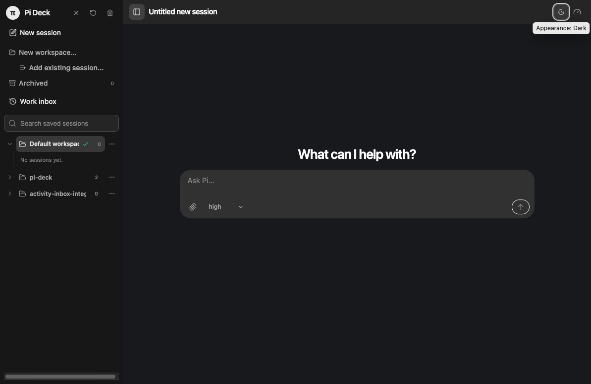
  </a>
</p>

- Create, rename, select, archive, and restore named workspaces.
- Keep workspace membership independent from Pi JSONL files and working folders.
- Open local project folders with the macOS directory picker and associate them with sessions.
- Persist recent projects and discover existing Pi JSONL sessions for their active project.
- Keep a default workspace persisted as an internal fallback for sessions created from All Work; its sidebar row and scope stay hidden until a named workspace exists, so workspace management is optional.
- Create a lightweight draft without starting Pi; the worker starts on first send.
- Resume saved sessions with their transcript and persisted image inputs.
- Search, refresh, close, resume, move, remove, archive, restore, and delete sessions.
- Close an idle runtime without deleting its session, then reopen it later.
- Move deleted session files to Trash when possible.
- Keep active workers attached when navigating to another workspace or project.

### All Work, workspace Work, and session detail

**All Work** is the global Work overview for supervising active and saved work across active workspaces. Selecting a workspace opens the same Work surface scoped to that workspace; it is a context choice, not a separate mode. Filter by **Needs attention**, **Failed**, **Pending**, **In progress**, **Completed**, or **Idle**. Idle saved sessions remain discoverable without increasing actionable counts.

Work is a stable primary surface, not a closable inbox or persisted Work entity. It is a renderer-derived projection of runtime state and Pi session metadata. Selecting a Work row opens the existing Pi session detail, and Back returns to the exact All Work or workspace Work origin. Users can choose **New session** from either surface without managing workspace membership first: global creation uses the persisted default workspace internally, while scoped creation uses the selected workspace.

<p align="center">
  <a href="docs/assets/pi-deck-dark.png" title="Open the All Work overview screenshot full size">
    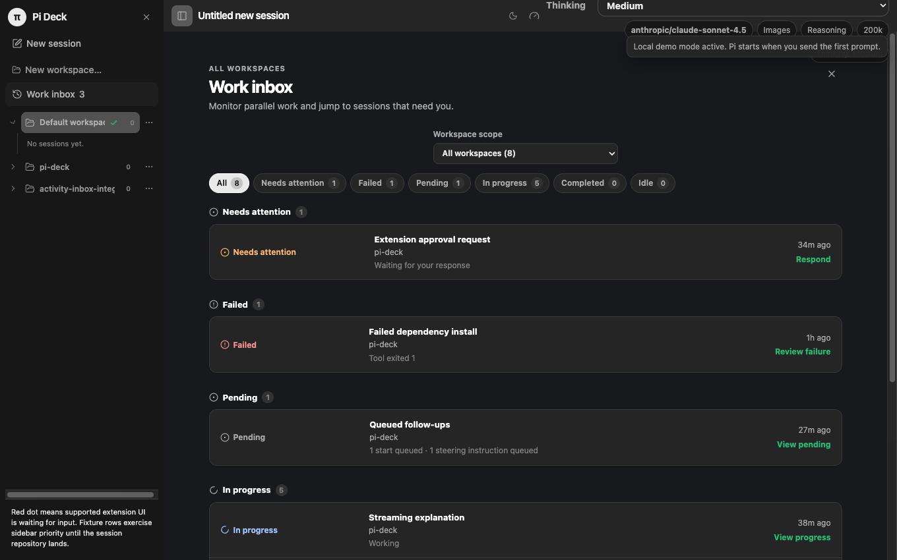
  </a>
  <a href="docs/assets/pi-deck-inbox.png" title="Open the workspace Work screenshot full size">
    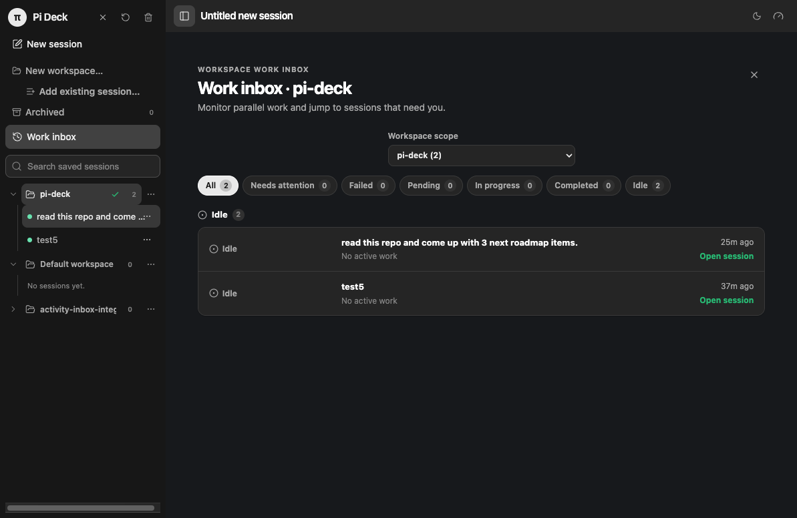
  </a>
</p>

The scoped Work view keeps saved work grouped and easy to reopen without changing Pi session files or restarting active runtimes.

### Agent Workflows

<p align="center">
  <a href="docs/assets/pi-deck-workflow-builder.png" title="Open the Agent Workflow builder screenshot full size">
    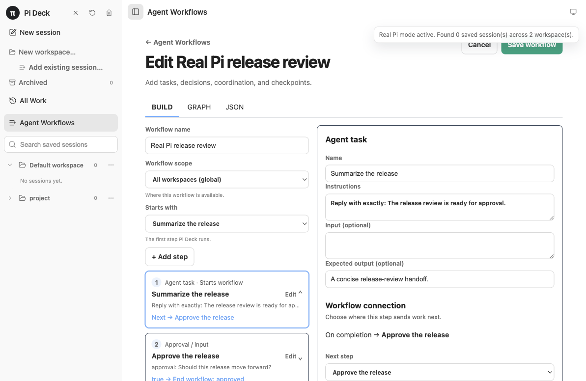
  </a>
</p>

Create persistent global or workspace-scoped workflows for repeatable multi-agent work. Build a workflow visually or edit its canonical JSON, then start a run and follow its live, keyboard-accessible execution graph.

- Combine **Worker**, **Decider**, **Orchestrator**, and **Human** roles.
- Route between steps based on decisions; use bounded loops or bounded-concurrency fan-out where appropriate.
- Configure workflow inputs, model/thinking overrides, and retry attempts for model-backed roles.
- Monitor queued, running, waiting, completed, failed, and skipped occurrences; inspect outputs and open the associated Pi session when one exists.
- Answer Human input, approval, or choice checkpoints without creating a model-backed Pi session.
- Retry failed or cancelled occurrences, stop a run, and recover persisted definitions and runs after restart.

#### Start from a feature-delivery template

Use [`docs/examples/feature-delivery-workflow.json`](docs/examples/feature-delivery-workflow.json) as a small canonical starting point: a Pi worker plans the change, a Human approves it, then a second Pi worker implements it. Open **Agent Workflows**, create a workflow, and use the **JSON** view to adapt the template to your project.

<p align="center">
  <a href="docs/assets/pi-deck-workflow-run.png" title="Open the live workflow screenshot full size">
    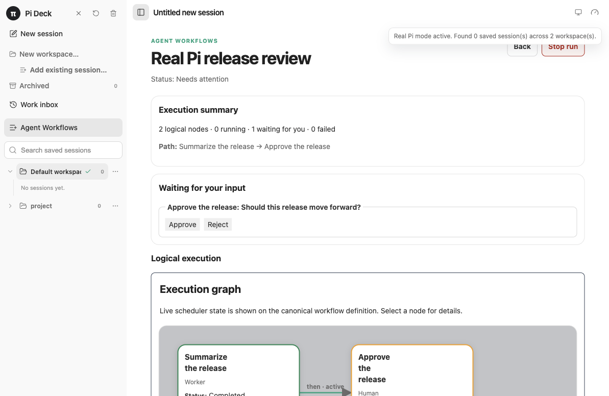
  </a>
  <a href="docs/assets/pi-deck-workflow-run.gif" title="Open the real Pi workflow walkthrough full size">
    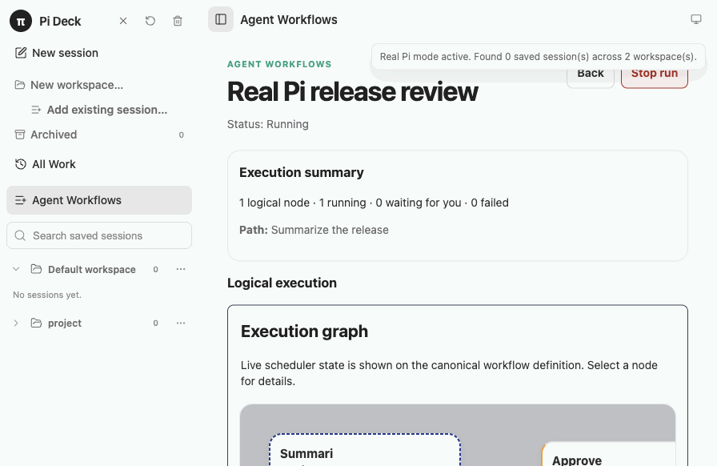
  </a>
</p>

_These captures use a real local Pi worker and a persisted Pi session; the workflow then pauses at the Human checkpoint._

### Multi-session control and multitasking

Each attached conversation has its own `pi --mode rpc` subprocess and event stream. Pi Deck routes actions by runtime ID so a stale prompt, abort, or close request cannot be redirected to the wrong conversation.

- Independent foreground and background workers.
- Configurable attached-worker capacity: **4 by default**, with a hard maximum of **20**.
- Duplicate resume protection for the same session file.
- Visible state for starting, working, tool execution, waiting for input, retrying, compacting, queued messages, idle, and errors.
- Attention-first ordering keeps sessions that need input or recovery visible.
- Runtime reconciliation recovers the UI when a terminal completion event is missed.

#### Interactive multitasking

Pi Deck's approved multitasking model is based on parent-owned **task sessions**. With **Parallel: Off**, prompts run in the parent. With **Parallel: On**, every prompt enters automatic planning and defaults to one or more private task sessions; the user can choose **Work in parent** for an individual prompt. Routing into planning is deterministic Pi Deck behavior, while the parent intelligently decomposes independent work.

- A parent can own many task sessions while remaining available for conversation.
- A flat task panel inside the parent shows task briefs, queued/running/retrying status, elapsed time, and attempt count. Rows are informational and cannot be opened or controlled.
- Task sessions receive summarized parent context and inherit its model/thinking settings unless persistent or per-prompt worker overrides are specified.
- Each parent has a soft limit of 10 active task sessions; excess tasks queue automatically and never fall back silently to the parent.
- Failed tasks retry up to three times. Once every task for that prompt is terminal, the parent reports successful results and terminal failures, then clears those task rows.
- Unfinished private sessions do not resume after restart; the parent restores their context and trace and reports them as interrupted.

The canonical behavior and security contract is [Parallel Task Sessions Design](docs/parallel-task-sessions-design.md). Interactive multitasking predates v0.5.5; v0.5.5 specifically shipped deterministic private Parallel task-session routing. The v0.6.0 pre-release carries that routing forward and integrates it with Unified Work. The v0.6.0 candidate retains deterministic routing, private model-backed planning, the prompt destination/settings UI, task panel, retries, synthesis, attachment handling, and interrupted restart behavior. Private task sessions stay parent-facing and are not promoted into normal Work rows.

<p align="center">
  <a href="docs/assets/pi-deck-multitasking.png" title="Open the parallel multitasking screenshot full size">
    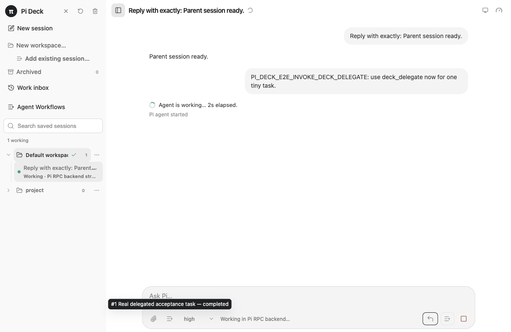
  </a>
</p>

_This authenticated capture uses Pi Deck's production Parallel planner and real private Pi workers; private details remain intentionally parent-facing and outside normal Work._

### Chat and intervention controls

<p align="center">
  <a href="docs/assets/pi-deck-conversation.png" title="Open the Pi session detail screenshot full size">
    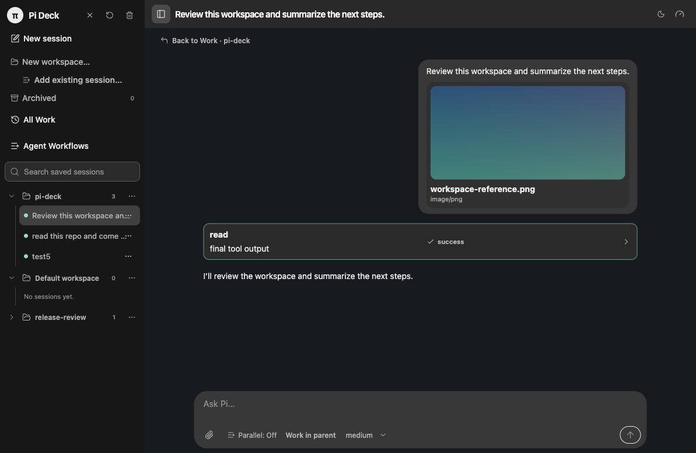
  </a>
</p>

The conversation view shows the composer, image attachment preview, Pi tool execution, streaming response, and controls for steering, following up, or aborting.

<p align="center">
  <a href="docs/assets/pi-deck-conversation.gif" title="Open the Pi Deck conversation walkthrough full size">
    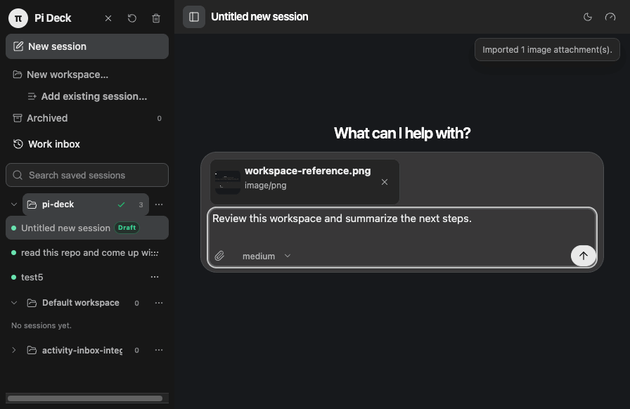
  </a>
</p>

_A deterministic real-mode UI walkthrough driven by production-shaped fake Pi RPC fixtures (not an actual Pi worker): attach an image, send the prompt, watch the fixture emit a tool event, and follow the response as it streams._

- Streaming assistant responses rendered as safe Markdown.
- Collapsible thinking sections.
- Expandable tool cards with running, success, and error states.
- Long-running status with elapsed time and the latest observed Pi phase.
- **Steer** an active turn as soon as Pi can accept the instruction.
- Queue a **Follow-up** for after the current work finishes.
- Run active-worker extension commands immediately through Pi's prompt path.
- **Abort** current work and reconcile the resulting runtime state.
- Retry failed prompts, reopen exited saved sessions, and copy session diagnostics.

### Models, thinking, commands, and usage

<p align="center">
  <a href="docs/assets/pi-deck-models.png" title="Open the model and thinking controls screenshot full size">
    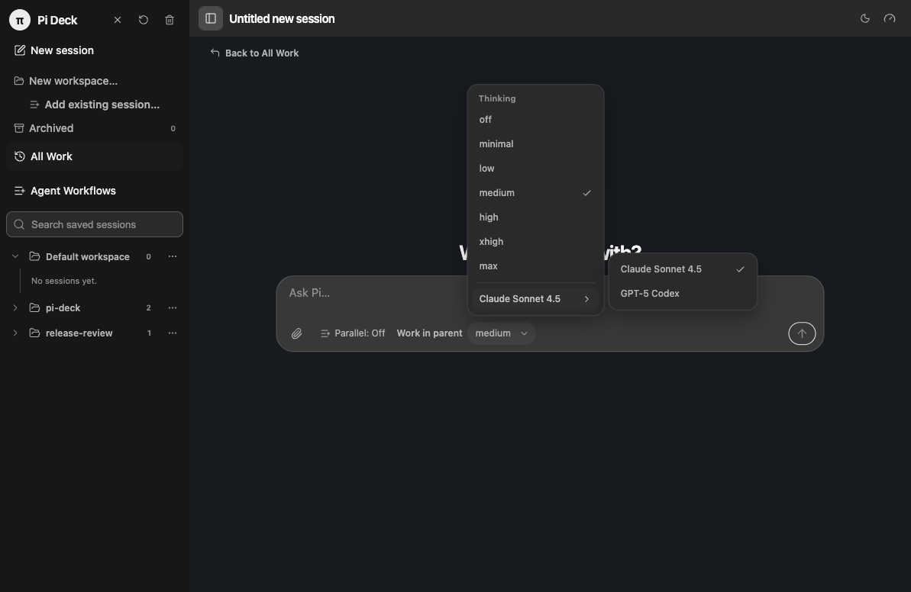
  </a>
</p>

- Discover available models from the active Pi runtime.
- Use model capability metadata such as image input, reasoning, and context window to gate available controls and report usage.
- Switch model and thinking level per session.
- Discover slash commands exposed by the active worker, including skills and prompt templates.
- Exclude terminal-only commands that do not have a meaningful GUI workflow.
- Display context usage, input/output tokens, cache reads/writes, and provider cost when Pi reports them.

### Appearance

<p align="center">
  <a href="docs/assets/pi-deck-appearance.png" title="Open the appearance menu screenshot full size">
    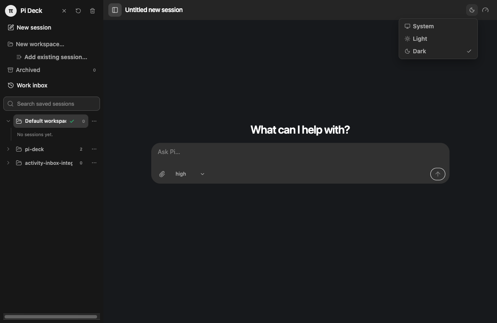
  </a>
</p>

- Follow the current macOS appearance by default.
- Choose System, Light, or Dark from the appearance menu in the chat header.
- Persist an explicit appearance choice across application restarts.

### Files and images

- Select one or more files through the native macOS picker.
- Drag files or images into the composer.
- Paste images directly from the clipboard.
- Preview selected images before sending and restore previews in resumed sessions.
- Send PNG, JPEG, WebP, and GIF image inputs when the active model supports images.
- Enforce byte-signature detection, a 20 MB limit, and a 50-megapixel safety limit.
- Resize oversized images to a maximum 2000 × 2000 bounding box when Pi's effective `images.autoResize` setting is enabled.
- Respect Pi's effective `images.blockImages` setting.
- Send non-image files as explicit **referenced paths**, rather than claiming their contents were uploaded.
- Prefer project-relative references and warn when a path is outside the project, missing, unreadable, binary, or unusually large.

### Extension requests

<p align="center">
  <a href="docs/assets/pi-deck-extension.png" title="Open the extension request screenshot full size">
    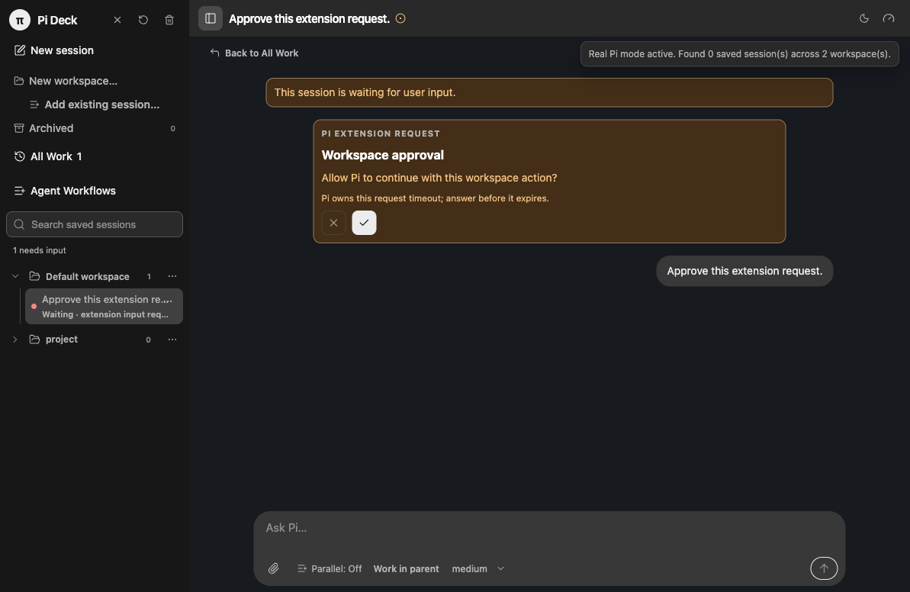
  </a>
</p>

Pi Deck can render and answer the blocking extension UI methods currently covered by the desktop bridge:

- `select`
- `confirm`
- `input`
- `editor`

A background request marks its session as needing input without stealing focus. Responses remain scoped to the worker and request that produced them, and stale or timed-out responses are rejected.

## How it works

```text
┌──────────────────────── Electron app ────────────────────────┐
│                                                              │
│  React renderer                                              │
│  All Work · Workspace Work · Session detail · Agent Workflows  │
│              │                                               │
│              │ validated, typed IPC                          │
│              ▼                                               │
│  Electron main process                                      │
│  Workspace/project/workflow stores · Session index           │
│  Workflow runtime · Task-session planner · Attachments       │
│              │                                               │
│              │ PiAdapter + strict JSONL transport            │
│              ▼                                               │
│  One local `pi --mode rpc` subprocess per attached session   │
│  Ephemeral private task-session workers for Parallel mode    │
│                                                              │
└──────────────────────────────────────────────────────────────┘
                         │
                         ▼
       Pi settings, provider auth, resources, and sessions
```

The renderer has no direct filesystem or process access. Electron main owns Pi subprocesses, selected-file tokens, workspace/project/workflow metadata, runtime scheduling, task-session planning, and session validation. Pi's session files remain the source of truth for conversation history; Pi Deck derives Work from runtime state and session metadata rather than persisting a separate Work entity. Workflow definitions and occurrence runs are Pi Deck metadata, while model-backed workflow roles use Pi sessions. Workspace membership does not require moving Pi's JSONL files or changing working folders, and the persisted default workspace remains the internal fallback for global session creation. Ordinary Parallel mode uses deterministic prompt routing and private parent-owned task workers; the legacy authenticated bridge is compatibility-only and opt-in.

## Requirements

- **macOS** — the current MVP target.
- **Node.js 22.12 or newer**.
- **npm**.
- A working `pi` executable that supports RPC mode.
- Pi provider authentication configured as it would be for normal Pi use.

Confirm Pi is available before launching:

```bash
pi --version
```

The launcher can resolve Pi from an explicit `--pi` path, `PI_DECK_PI_BINARY`, `PATH`, or common macOS install locations.

## Quick start

```bash
git clone https://github.com/LiusuZeng/pi-deck.git
cd pi-deck
npm ci
npm run build
npm run deck:real -- /absolute/path/to/your/project
```

### First run

1. Confirm `pi --version` succeeds and its provider authentication is configured.
2. Launch Pi Deck with your project path; it opens at **All Work**. Start a session directly, or select/create a workspace when you want a scoped Work context.
3. Start a **New session** for ad-hoc work, or open **Agent Workflows** and create a workflow from the visual builder or JSON template.
4. Start the session or workflow run, then move from All Work to scoped Work and session detail, or follow the live workflow graph.

The production-style launcher uses the existing `dist` output and deliberately does **not** rebuild it. Rebuild after pulling or changing source:

```bash
npm run build
```

To build and launch a project in one command:

```bash
npm run deck:real:build -- /absolute/path/to/your/project
```

To use the repository directory itself as the project:

```bash
npm start
```

### Development mode

```bash
npm run dev:real -- /absolute/path/to/your/project
```

This starts Vite for renderer hot reload and launches Electron against the real Pi backend. Main-process or preload changes still require a restart.

See every launcher option without starting the app:

```bash
npm run deck -- --help
npm run deck:real -- --dry-run /absolute/path/to/your/project
```

### Refreshing documentation screenshots

The standard documentation capture uses Electron's real-mode UI and production
backend wiring with a generated `pi --mode rpc` shim backed by deterministic,
production-shaped fake Pi RPC fixtures. It does not invoke an actual Pi
executable or contact a model provider, so these captures are deterministic
fake-Pi evidence of the real-mode UI—not captures from actual Pi. The command
refreshes the workspace, All Work, scoped Work, session detail, model,
appearance, extension, and conversation assets in both `docs/assets` and
`site/assets`:

```bash
npm run docs:capture
```

The Agent Workflow and multitasking assets use a separate authenticated capture
with actual local Pi workers. Use a configured provider account for that command;
it contacts the configured model provider and keeps the temporary project,
sessions, and Pi Deck metadata isolated:

```bash
PI_DECK_CAPTURE_REAL_PI=1 npm run docs:capture:real-workflows
```

Refresh the GitHub Pages social-preview PNG after changing its SVG source:

```bash
npm run docs:render-social-preview
```

Set `CHROME_PATH` when Google Chrome is installed somewhere other than the script's default macOS location.

## Typical workflow

1. Launch Pi Deck at **All Work**; select a workspace when you want its scoped Work overview.
2. Open a project with **Open project**, select an existing session, or use All Work to review activity across all workspaces.
3. For an ad-hoc task, create a **New session** draft from All Work or scoped Work, choose the model and thinking level, add referenced files or image inputs, and send a prompt.
4. Pi starts lazily and streams into the timeline while other workers remain attached in the background.
5. For repeatable multi-agent work, open **Agent Workflows**, create or select a workflow, provide its run inputs, and start it.
6. Follow the live graph, answer Human checkpoints, retry or stop occurrences, and open a worker's Pi session when you need to intervene.
7. Enable parallel mode on a parent to make each prompt default to an automatically planned set of private task sessions, or choose **Work in parent** for a one-prompt override.
8. Use **Steer**, **Follow-up**, or **Abort** while a turn is active; return to All Work or scoped Work to triage the next session.
9. Close an idle runtime to free capacity while keeping its saved session resumable.

Press **Enter** to send or steer. Use **Shift+Enter** for a newline.

## Configuration

The launcher accepts a project path positionally or through `--project`:

```bash
npm run deck:real -- --pi /absolute/path/to/pi /absolute/path/to/project
```

Useful environment overrides:

| Variable                                       | Purpose                                                                                                          |
| ---------------------------------------------- | ---------------------------------------------------------------------------------------------------------------- |
| `PI_DECK_PI_BINARY`                            | Absolute path to the Pi executable                                                                               |
| `PI_DECK_PROJECT_CWD`                          | Initial project directory                                                                                        |
| `PI_CODING_AGENT_DIR`                          | Override Pi's agent/configuration directory                                                                      |
| `PI_CODING_AGENT_SESSION_DIR`                  | Override Pi's session directory                                                                                  |
| `PI_DECK_HOME`                                 | Override Pi Deck's local metadata directory                                                                      |
| `PI_DECK_REAL_RPC_TIMEOUT_MS`                  | Override the RPC command-response timeout                                                                        |
| `PI_DECK_SCAN_PROJECT_SESSION_DIR_CANDIDATE=1` | Explicitly include a trust-dependent project `sessionDir` candidate in bounded scanning                          |
| `PI_DECK_ENABLE_LEGACY_DELEGATE_BRIDGE=1`      | Opt in to the model-visible legacy `deck_delegate` compatibility tool; ordinary Parallel routing does not use it |

Pi Deck narrowly reads effective `sessionDir`, `images.blockImages`, and `images.autoResize` values needed before worker launch. Other Pi settings and resource behavior remain owned by Pi.

The appearance menu stores Pi Deck's own `system`, `light`, or `dark`
preference in the local application settings. System mode responds to macOS
appearance changes while the app is running.

## Local data and privacy

Pi Deck has no hosted backend and does not sync app data.

- **Conversation history:** Pi-owned JSONL session files in Pi's resolved session directory.
- **Workspace metadata:** `~/.pideck/workspaces.json` by default.
- **Project metadata:** `~/.pideck/projects.json` by default.
- **Workflow definitions and occurrence runs:** `~/.pideck/workflows.json` by default.
- **Task-session state:** `task-session-state.json` in Electron's local user-data directory. It retains bounded parent planning/trace metadata, attempts, status transitions, and terminal handoffs—not private runtime/session IDs, session paths, transcripts, raw tool output, attachment tokens, or image payloads. `multitask-state.json` remains compatibility state for the legacy bridge.
- **App settings and diagnostics:** Electron's local user-data directory.
- **Provider authentication and Pi resources:** Pi's normal agent directory, `~/.pi/agent` by default.

“Local” describes the desktop control plane. Pi may still contact configured model providers, run network-capable tools, and perform its normal startup checks according to your Pi settings and environment.

Security boundaries include:

- Sandboxed renderer with `contextIsolation: true` and Node integration disabled.
- Runtime validation for IPC requests and responses.
- Strict production Content Security Policy.
- Opaque selected-file tokens instead of renderer-controlled read paths.
- Session path, extension, header, project, and session-directory validation before resume or deletion.
- Image content sniffing and decode-safety limits in Electron main.
- External-link allowlisting for `http`, `https`, and `mailto`.

## Current limitations

- Pi Deck currently runs from source; there is no signed/notarized installer or packaged release yet.
- macOS is the supported MVP target.
- Ad-hoc session starts are blocked when attached-worker capacity is reached. Workflow occurrences and private task sessions use bounded queues and share that capacity.
- There is not yet a full settings or diagnostics screen; some advanced configuration remains environment/file driven.
- Project resources follow Pi's own trust and settings behavior; Pi Deck does not yet provide a project trust or resource-inspection panel.
- Custom extension interfaces beyond `select`, `confirm`, `input`, and `editor` are not rendered as bespoke GUI components.
- Tool cards do not yet provide rich diffs, output search, or advanced filtering.
- Concurrent external writes to the same session from Pi Deck and another Pi process are unsupported.
- After an Electron main-process crash, Pi Deck cannot reconnect to an already-running RPC subprocess. Persisted sessions can be reopened after restart, but unsaved partial stream text may be lost.

## Development and validation

Run the standard checks:

```bash
npm test
npm run typecheck
npm run format
npm run build
npm run check:site
npm run test:e2e
```

Validate the installed Pi RPC path separately:

```bash
# Isolated get_state/get_messages health check; no model prompt
npm run smoke:real

# Minimal authenticated prompt round-trip
npm run smoke:real:prompt

# Real GUI project/session restart-and-resume flow
npm run test:e2e:real-smoke
```

The prompt and GUI smoke commands require working provider authentication and may contact the configured model provider. The GitHub Pages deployment also runs `npm run check:site` before uploading the site artifact.

## Repository layout

```text
src/main/             Electron backend, Pi workers, workspaces, projects, sessions, attachments
src/main/workflows/   Workflow persistence, occurrence runtime, scheduling, rehydration, and graph snapshots
src/main/multitask/   Parallel planning, private task scheduling, compatibility bridge, and task state
src/preload/          Sandboxed, validated renderer API
src/renderer/         React All Work, session detail, workflow UI, Parallel controls, and runtime-state reduction
src/shared/           IPC schemas and shared TypeScript types, including canonical workflow contracts
scripts/              Launch, build-validation, and real Pi smoke tooling
e2e/                  Playwright Electron end-to-end coverage, including workflows and live runs
docs/                 Requirements, architecture, plans, and validation records
```

## Further documentation

- [How to run and test Pi Deck](docs/how-to-run-and-test.md)
- [Product requirements](docs/requirements.md)
- [Technical architecture](docs/technical-architecture.md)
- [Agent Workflows design](docs/agent-workflows-role-based-design.md)
- [Agent Workflows UX feedback](docs/agent-workflows-feedback.md)
- [Project-grouped sessions design](docs/project-grouped-sessions-p0-design.md)
- [v0.6.0 Unified Work release validation](docs/reviews/v0.6-unified-work-release-validation.md)
- [Real Pi validation history](docs/real-pi-gui-chat-validation.md)
- [Implementation tracker](docs/project-tracker.md)
